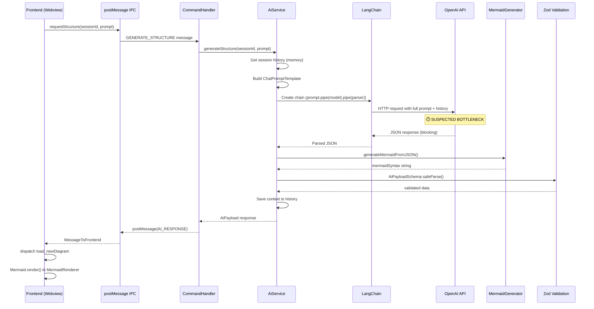

# Performance Analysis: Slow Diagram Generation (15-20s Response Time)

## Problem Statement

User experiences 15-20 second delay when interacting with the extension to generate architecture diagrams. This significantly degrades UX.

## End-to-End Flow Analysis



---

## Identified Bottlenecks

### 1. OpenAI API Call (CRITICAL - Est. 10-18s)

**Location**: [AiService.ts:134](file:///home/namtroi/arkhe/src/services/AiService.ts#L134)

```typescript
const rawJson = await chain.invoke({
  chat_history: historyMessages,
  input: userPrompt,
});
```

**Root Causes**:

- **Synchronous blocking call** - No streaming, waits for full response
- **Large system prompt** - 260 lines (~9KB) sent every request
- **Chat history included** - Grows with each interaction
- **JSON mode overhead** - `response_format: { type: 'json_object' }` may add latency

**Evidence**:

- System prompt in [SystemPrompt.ts](file:///home/namtroi/arkhe/src/services/SystemPrompt.ts) is ~260 lines with 2 full examples
- History accumulates via `SessionManager` without pruning

---

### 2. Model Cold Start (Potential - Est. 1-3s)

**Location**: [AiService.ts:42-50](file:///home/namtroi/arkhe/src/services/AiService.ts#L42-L50)

```typescript
const instance = new ChatOpenAI({
  modelName: model,
  temperature: type === "json" ? 0 : 0.7,
  apiKey: apiKey,
  modelKwargs:
    type === "json" ? { response_format: { type: "json_object" } } : undefined,
});
```

Model is lazily initialized. First request after config change triggers full initialization.

---

### 3. Chat History Unbounded Growth

**Location**: [AiService.ts:110-111](file:///home/namtroi/arkhe/src/services/AiService.ts#L110-L111)

```typescript
const history = sessionManager.getSession(sessionId);
const historyMessages = await history.getMessages();
```

No visible history truncation. Long sessions = massive token counts = high latency.

---

### 4. Synchronous IPC Pattern

**Location**: [vsCodeApi.ts:125-161](file:///home/namtroi/arkhe/webview-ui/src/shared/utils/vsCodeApi.ts#L125-L161)

Frontend blocks on Promise until `AI_RESPONSE` arrives. No progress feedback.

---

### 5. Mermaid Rendering (Frontend - Minor)

**Location**: [MermaidRenderer.tsx:66-105](file:///home/namtroi/arkhe/webview-ui/src/features/diagram/MermaidRenderer.tsx#L66-L105)

`mermaid.render()` is async but generally fast (<500ms). Not the primary bottleneck.

---

## Bottleneck Impact Breakdown (Estimated)

| Component                        | Estimated Time | Confidence |
| -------------------------------- | -------------- | ---------- |
| OpenAI API (network + inference) | 10-18s         | High       |
| System prompt size overhead      | 1-2s           | Medium     |
| Chat history tokens              | 1-3s           | Medium     |
| LangChain overhead               | 200-500ms      | Low        |
| Mermaid generation (backend)     | <50ms          | Low        |
| IPC round-trip                   | <100ms         | Low        |
| Mermaid rendering (frontend)     | 100-500ms      | Low        |
| Zod validation                   | <10ms          | Low        |

---

## Proposed Solutions

### Phase 1: Implement Performance Tracking (Prerequisite)

Add timing instrumentation to identify exact bottlenecks before optimization.

#### Backend Changes

##### [AiService.ts](file:///home/namtroi/arkhe/src/services/AiService.ts)

```diff
+ interface PerformanceMetrics {
+   totalTime: number;
+   historyLoadTime: number;
+   apiCallTime: number;
+   mermaidGenTime: number;
+   validationTime: number;
+   historyTokenCount?: number;
+ }

  async generateStructure(sessionId: string, userPrompt: string): Promise<AiPayload> {
+   const metrics: Partial<PerformanceMetrics> = {};
+   const totalStart = performance.now();
+
    try {
+     const historyStart = performance.now();
      const sessionManager = SessionManager.getInstance();
      const history = sessionManager.getSession(sessionId);
      const historyMessages = await history.getMessages();
+     metrics.historyLoadTime = performance.now() - historyStart;
+     metrics.historyTokenCount = historyMessages.length;

      // ... prompt template creation ...

+     const apiStart = performance.now();
      const rawJson = await chain.invoke({
        chat_history: historyMessages,
        input: userPrompt,
      });
+     metrics.apiCallTime = performance.now() - apiStart;

      // ... TRIGGER_SCAN handling ...

+     const mermaidStart = performance.now();
      if (rawJson?.type === 'DIAGRAM' && rawJson?.data?.jsonStructure) {
        const syntax = generateMermaidFromJSON(rawJson.data.jsonStructure);
        rawJson.data.mermaidSyntax = syntax;
      }
+     metrics.mermaidGenTime = performance.now() - mermaidStart;

+     const validationStart = performance.now();
      const validation = AiPayloadSchema.safeParse(rawJson);
+     metrics.validationTime = performance.now() - validationStart;

      // ... rest of the function ...

+     metrics.totalTime = performance.now() - totalStart;
+     console.log('[AiService] Performance Metrics:', JSON.stringify(metrics));

      return validatedData;
```

##### [CommandHandler.ts](file:///home/namtroi/arkhe/src/handlers/CommandHandler.ts)

```diff
  case 'GENERATE_STRUCTURE': {
+   const cmdStart = performance.now();
    const { sessionId, prompt } = msg.payload;

    const aiResponsePayload = await aiService.generateStructure(sessionId, prompt);

+   console.log(`[CommandHandler] GENERATE_STRUCTURE total: ${performance.now() - cmdStart}ms`);
    // ...
  }
```

#### Frontend Changes

##### [Aichat.tsx](file:///home/namtroi/arkhe/webview-ui/src/features/chat/Aichat.tsx)

```diff
  const handleSubmit = async (e: FormEvent) => {
    e.preventDefault();
    if (!prompt || state.view.isLoading) return;
+   const requestStart = performance.now();
    dispatch({ type: 'send_userInput' });
    const sessionId = state.session.sessionId;
    try {
      const response = await requestStructure(sessionId, prompt);
+     console.log(`[Frontend] Request round-trip: ${performance.now() - requestStart}ms`);
      // ...
```

##### [MermaidRenderer.tsx](file:///home/namtroi/arkhe/webview-ui/src/features/diagram/MermaidRenderer.tsx)

```diff
  useEffect(() => {
    // ... mermaid.initialize ...
    if (!containerRef.current) return;
    const id = 'mermaid-' + Math.random().toString(36).substring(2);
+   const renderStart = performance.now();
    mermaid
      .render(id, code)
      .then(({ svg }) => {
+       console.log(`[Mermaid] Render time: ${performance.now() - renderStart}ms`);
        if (!containerRef.current) return;
        // ...
```

---

### Phase 2: Quick Wins (After Metrics Confirm)

#### 2.1 Implement Response Streaming

Replace blocking `chain.invoke()` with streaming:

```typescript
import { StringOutputParser } from "@langchain/core/output_parsers";

// For text responses (non-JSON), use streaming
const stream = await chain.stream({
  chat_history: historyMessages,
  input: userPrompt,
});

for await (const chunk of stream) {
  // Send partial updates to frontend
  this.panel.webview.postMessage({
    command: "AI_STREAM_CHUNK",
    payload: { chunk },
  });
}
```

> [!WARNING]
> Streaming may not work with `json_object` response_format. Need to test.

#### 2.2 Optimize System Prompt

Current system prompt is 260 lines. Options:

1. **Remove examples** - Keep only essential rules (save ~100 lines)
2. **Use few-shot in history** - Load examples as initial conversation turns
3. **Dynamic examples** - Only include relevant example based on user input

#### 2.3 Truncate Chat History

Add history windowing in `SessionManager`:

```typescript
const MAX_HISTORY_MESSAGES = 10;

getMessages() {
  const all = this.history.getMessages();
  if (all.length > MAX_HISTORY_MESSAGES) {
    return all.slice(-MAX_HISTORY_MESSAGES);
  }
  return all;
}
```

#### 2.4 Use Faster Model

Consider using `gpt-4o-mini` instead of `gpt-4o` for diagram generation:

- 5-10x faster response times
- Sufficient for structured JSON output
- Lower cost

---

### Phase 3: Advanced Optimizations

#### 3.1 Add Cancel/Abort Support

Allow users to cancel long-running requests:

```typescript
// Backend
const controller = new AbortController();
const model = new ChatOpenAI({
  // ...
  configuration: { signal: controller.signal },
});
```

#### 3.2 Caching Layer

Cache common prompts (starter options) with TTL:

```typescript
const cache = new Map<string, { result: AiPayload; timestamp: number }>();
const CACHE_TTL = 5 * 60 * 1000; // 5 minutes
```

#### 3.3 Preload Model on Extension Activation

Initialize the model during activation instead of lazy init:

```typescript
// extension.ts
export function activate(context) {
  // Eagerly initialize model
  aiService.warmup();
}
```

---

## Verification Plan

### Phase 1 Verification (Timing)

After implementing timing instrumentation:

1. Open VS Code with extension
2. Open Developer Tools (Help → Toggle Developer Tools)
3. Go to Console tab
4. Send a prompt: "Create a Next.js app with Prisma"
5. Observe timing logs:
   ```
   [AiService] Performance Metrics: {"historyLoadTime":5,"apiCallTime":12340,"mermaidGenTime":12,"validationTime":3,"totalTime":12400,"historyTokenCount":0}
   [CommandHandler] GENERATE_STRUCTURE total: 12405ms
   [Frontend] Request round-trip: 12450ms
   [Mermaid] Render time: 230ms
   ```
6. Repeat 3-5 times to get average

### Expected Findings

| Metric            | Expected Range                | Action if High          |
| ----------------- | ----------------------------- | ----------------------- |
| apiCallTime       | 10-15s                        | Streaming, faster model |
| historyLoadTime   | <100ms (unless large history) | Truncate history        |
| mermaidGenTime    | <100ms                        | No action               |
| validationTime    | <50ms                         | No action               |
| historyTokenCount | Varies                        | Truncate if >20         |

---

## Implementation Order

1. **Phase 1**: Add timing instrumentation (LOW RISK, HIGH VALUE)
2. **Collect data**: Run 5-10 real requests, analyze logs
3. **Phase 2.4**: Try `gpt-4o-mini` (QUICK WIN, if acceptable quality)
4. **Phase 2.3**: Truncate history (LOW RISK)
5. **Phase 2.2**: Optimize system prompt (MEDIUM RISK - may affect output quality)
6. **Phase 2.1**: Implement streaming (MEDIUM EFFORT)
7. **Phase 3**: Advanced optimizations as needed

---

## Files to Modify

| File                                                                                                                                  | Changes                          |
| ------------------------------------------------------------------------------------------------------------------------------------- | -------------------------------- |
| [src/services/AiService.ts](file:///home/namtroi/arkhe/src/services/AiService.ts)                                                     | Add performance metrics          |
| [src/handlers/CommandHandler.ts](file:///home/namtroi/arkhe/src/handlers/CommandHandler.ts)                                           | Add timing log                   |
| [webview-ui/src/features/chat/Aichat.tsx](file:///home/namtroi/arkhe/webview-ui/src/features/chat/Aichat.tsx)                         | Add request timing               |
| [webview-ui/src/features/diagram/MermaidRenderer.tsx](file:///home/namtroi/arkhe/webview-ui/src/features/diagram/MermaidRenderer.tsx) | Add render timing                |
| [src/managers/SessionManager.ts](file:///home/namtroi/arkhe/src/managers/SessionManager.ts)                                           | Add history truncation (Phase 2) |
| [src/services/SystemPrompt.ts](file:///home/namtroi/arkhe/src/services/SystemPrompt.ts)                                               | Optimize prompt (Phase 2)        |
